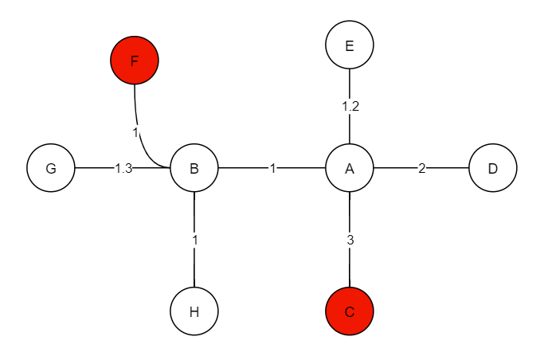
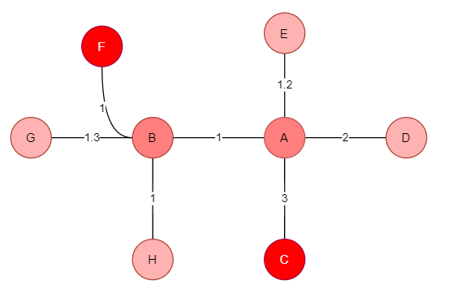
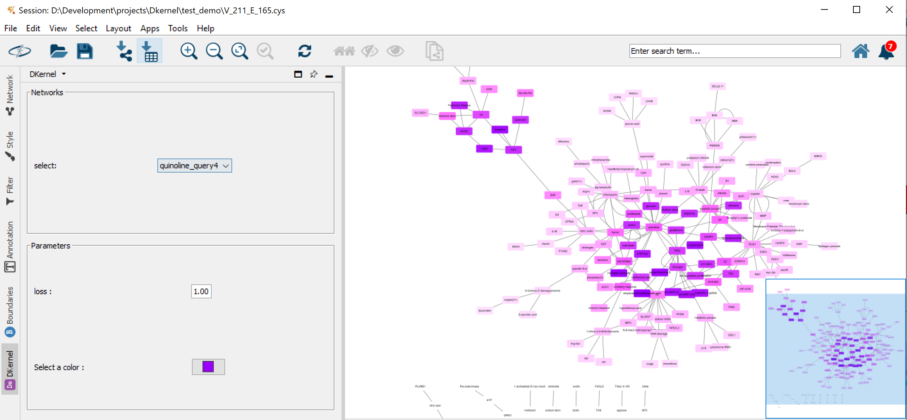

# Algorithms

This is a repository written in my experiments for several algorithms.

## HGA

Obtain reliable and optimal mapping between networks concerning about protein sequences and topological similarity  

Please refer to [An Adaptive Hybrid Algorithm for Global Network Alignment](http://dx.doi.org/10.1109/TCBB.2015.2465957) for the design of the algorithm.

### case 1 : biomolecular network

Get the mapping subgraph across species. 

### case 2: drug repurposing by alignment

You could navigate [here](https://github.com/164140757/MyAlgorithms/tree/master/src/main/java/Algorithms/Graph/HGA#gpu-acceleration) to see how to build HGA and run it.

## DK

Propagate the biological network for predicting novel genetic interactions and co-complex membership

Diffusion with source and sink. Fluid is pumped from the source into a selected set of query nodes and is allowed to leak out from each node into a sink at first-order rate. For clarity, an undirected network is shown above, which illustrates the initial state to the diffused and equilibrium result and 'F', 'C' are the source nodes.

For more information, a blog is available [here](http://www.haotian.life/2020/08/10/diffusion-kernel/). 

Code is available [here](https://github.com/164140757/MyAlgorithms/tree/master/src/main/java/Algorithms/Graph/Dynamic/Diffusion_Kernel).

Please refer to [Finding friends and enemies in an enemies-only network: A graph diffusion kernel for predicting
novel genetic interactions and co-complex membership from yeast genetic interactions](10.1101/gr.077693.108) for the design of the algorithm.

### Applications

* BNMatch(based on HGA)

  A Cytoscape app to reach optimized global mapping in biological networks, it will visualize the result returned from HGA.

  

  Please visit https://apps.cytoscape.org/apps/bnmatch2 for more information.

* DKernel(based on DK)

  A Cytoscape app to diffuse and propagate networks for disease gene pathway, social network, etc analysis, and it will visualize the result with a customized color choice.

  

  Please visit https://apps.cytoscape.org/apps/dkernel for more information.

