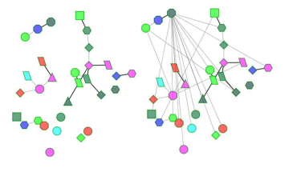
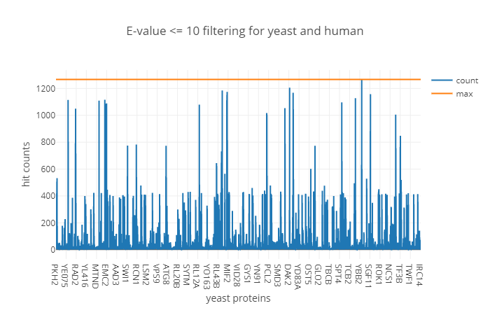
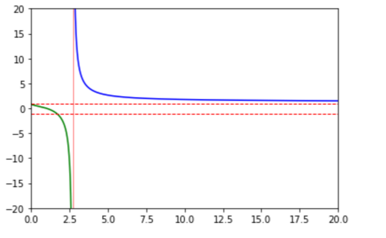

# Internal.Algorithms

This is a repository written in my experiments for several algorithms.

## HGA

Obtain reliable and optimal mapping between networks concerning about protein sequences and topological similarity  

### case 1 : biomolecular network

Get the mapping subgraph across species. 

http://dx.doi.org/10.1109/TCBB.2015.2465957

### case 2: drug repurposing by alignment

* parameters 

  * h

    

* E-value 

  