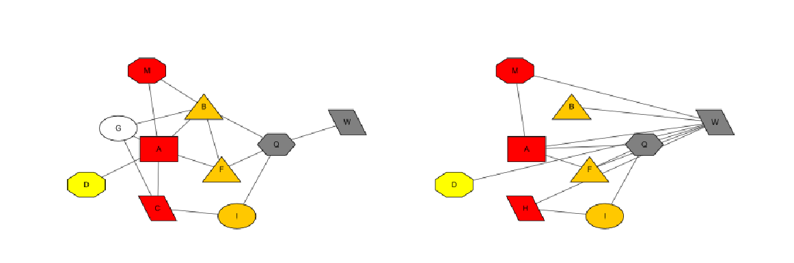

# Algorithms

This is a repository written in my experiments for several algorithms.

## HGA

Obtain reliable and optimal mapping between networks concerning about protein sequences and topological similarity  




Please refer to An Adaptive Hybrid Algorithm for Global Network Alignment[http://dx.doi.org/10.1109/TCBB.2015.2465957] for the design of the algorithm.

### case 1 : biomolecular network

Get the mapping subgraph across species. 

### case 2: drug repurposing by alignment


### How to run 

First you have to build by maven

```
mvn compile
```

Then, please navigate to the pom.xml file from the root, and comment the < skipTests > line in the plugin, then your tests could work.

```
 <plugin>
                <groupId>org.apache.maven.plugins</groupId>
                <artifactId>maven-surefire-plugin</artifactId>
                <version>${maven-surefire-plugin.version}</version>
                <configuration>
                      <!-- <skipTests>true</skipTests> -->
                </configuration>
 </plugin>

```

In your server command line, input the follow command

```
nohup mvn clean test -Dtest=Algorithms.Graph.HGA.HGARunSpec#<test> &
```

< test > can be any junit test class method, for example, < test > can be run_yeast like example below:

```java
 @Test
    void run_yeast() throws IOException {
         // reader for reading undirected graphs and the similarity matrix
        GraphFileReader reader = new GraphFileReader(true, false, false);
        // read graphs with the file path
        undG1 = reader.readToUndirectedGraph("src/test/java/resources/TestModule/HGATestData/Human-YeastSub38N/net-38n.txt", false);
        undG2 = reader.readToUndirectedGraph("src/test/java/resources/TestModule/HGATestData/Human-YeastSub38N/HumanNet.txt", false);
        // undirected graphs don't have to record neighbors
        reader.setRecordNeighbors(false);
        // read the simMat 
        simMat = reader.readToSimMat("src/test/java/resources/TestModule/HGATestData/Human-YeastSub38N/fasta/yeastHumanSimList_EvalueLessThan1e-10.txt",
                undG1.getAllNodes(), undG2.getAllNodes(), true);
        // hga init
        hga = new HGA(simMat, undG1, undG2, 0.4,true,0.5,0.01);
        // specify where you want the log matrix, score, and mapping result.
        HGA.debugOutputPath = "src\\test\\java\\resources\\Jupiter\\data\\";
        hga.run();
    }
```

Notice: the similarity matrix is consist of the index graph's nodes as its rows, and the target graph's as its columns.

The matrix's size should be equal to or more than m*n as it has to cover all pairs. 


It's flexible for you to write a new test method for your customized design and purpose.


If you would like to check the status of the current mapping, there is a HGALogFile.log in the root path.

```
Jul 12, 2020 10:59:22 AM Internal.Algorithms.Graph.HGA.HGA logInfo
INFO: Init mapping...
Jul 12, 2020 10:59:22 AM Internal.Algorithms.Graph.HGA.HGA logInfo
INFO: ------------Iteration 0/1000------------
Jul 12, 2020 10:59:22 AM Internal.Algorithms.Graph.HGA.HGA logInfo
INFO: Remapping...
Jul 12, 2020 10:59:22 AM Internal.Algorithms.Graph.HGA.HGA logInfo
INFO: Selecting 50.0% of rows for Hungarian allocation, and the left 50.0% for Greedy mapping.
Jul 12, 2020 10:59:22 AM Internal.Algorithms.Graph.HGA.HGA logInfo
INFO: Hungarian mapping...
Jul 12, 2020 10:59:22 AM Internal.Algorithms.Graph.HGA.HGA logInfo
INFO: Scoring for mapping ...
Jul 12, 2020 10:59:22 AM Internal.Algorithms.Graph.HGA.HGA logInfo
INFO: output matrix
Jul 12, 2020 10:59:22 AM Internal.Algorithms.Graph.HGA.HGA logInfo
INFO: output scores
Jul 12, 2020 10:59:22 AM Internal.Algorithms.Graph.HGA.HGA logInfo
INFO: output mapping
Jul 12, 2020 10:59:22 AM Internal.Algorithms.Graph.HGA.HGA logInfo
INFO: adjust neighborhood similarity based on mapping result...
Jul 12, 2020 10:59:22 AM Internal.Algorithms.Graph.HGA.HGA logInfo
INFO: AddTopology for all nodes pairs in two graphs:
Jul 12, 2020 10:59:22 AM Internal.Algorithms.Graph.HGA.HGA logInfo
```

When the matrix has converged, it will be an output information to denote that all iterations needed have been finished.

```
Jul 12, 2020 10:59:22 AM Internal.Algorithms.Graph.HGA.HGA logInfo
INFO: HGA mapping finish!With iteration 14 times.
Jul 12, 2020 10:59:22 AM Internal.Algorithms.Graph.HGA.HGA logInfo
INFO: output mapping
Jul 12, 2020 10:59:22 AM Internal.Algorithms.Graph.HGA.HGA logInfo
INFO: output matrix
Jul 12, 2020 10:59:22 AM Internal.Algorithms.Graph.HGA.HGA logInfo
INFO: output scores
```

### GPU acceleration 

The algorithm is still complicated as updating the matrix with topological information will be tedious. The time complexity will be (n*m)^2, for more information on how to implement this method, please visit my blog [here](http://www.haotian.life/2020/07/28/new-feature-gpu-for-hga/).

```
@Test
void run_test_GPU() throws IOException {
        GraphFileReader reader = new GraphFileReader(true, false, false);
        undG1 = reader.readToUndirectedGraph("src/test/java/resources/AlgTest/HGA/graph1.txt", false);
        undG2 = reader.readToUndirectedGraph("src/test/java/resources/AlgTest/HGA/graph2.txt", false);
        reader.setRecordNeighbors(false);
        simMat = reader.readToSimMat("src/test/java/resources/AlgTest/HGA/simMat.txt", undG1.getAllNodes(), undG2.getAllNodes(), true);
        hga = new HGA(simMat, undG1, undG2, 0.5,true,0.5,0.01);
        HGA.GPU = true;
        hga.run();
}
```

To enable GPU, just set HGA.GPU to true, but you should firstly make sure both drivers and environments have been properly set up. There are ample resources on the topic of how to make GPU work, and I will not explain it further.

 

You could contact me by bht98@i.shu.edu.cn  if there is some thorny problems you encounter.

### Applications

* BNMatch

  A Cytoscape app to reach optimized global mapping in biological networks, it will visualize the result returned from HGA.

  

  Please visit https://apps.cytoscape.org/apps/bnmatch2 for more information.

