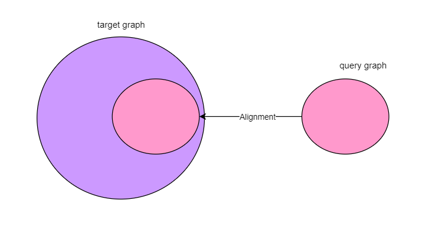
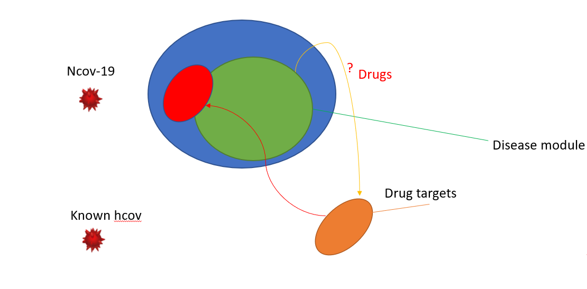
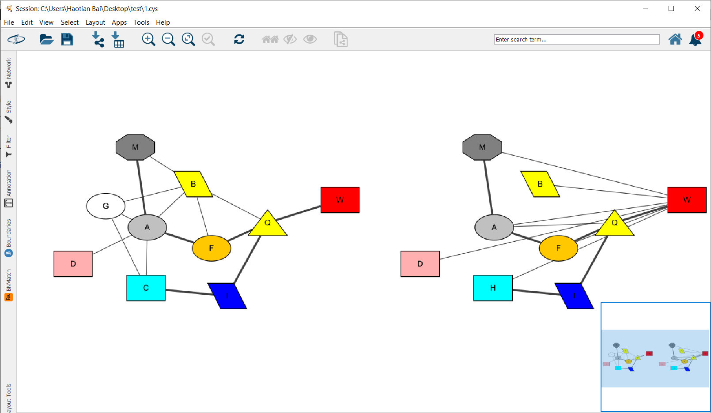

# Algorithms

This is a repository written in my experiments for several algorithms.

## HGA

Obtain reliable and optimal mapping between networks concerning about protein sequences and topological similarity  

Please refer to An Adaptive Hybrid Algorithm for Global Network Alignment[http://dx.doi.org/10.1109/TCBB.2015.2465957] for the design of the algorithm.

### case 1 : biomolecular network

Get the mapping subgraph across species. 

### case 2: drug repurposing by alignment

### Applications

* BNMatch

  A Cytoscape app to reach optimized global mapping in biological networks, it will visualize the result returned from HGA.

  

  Please visit https://apps.cytoscape.org/apps/bnmatch2 for more information.

